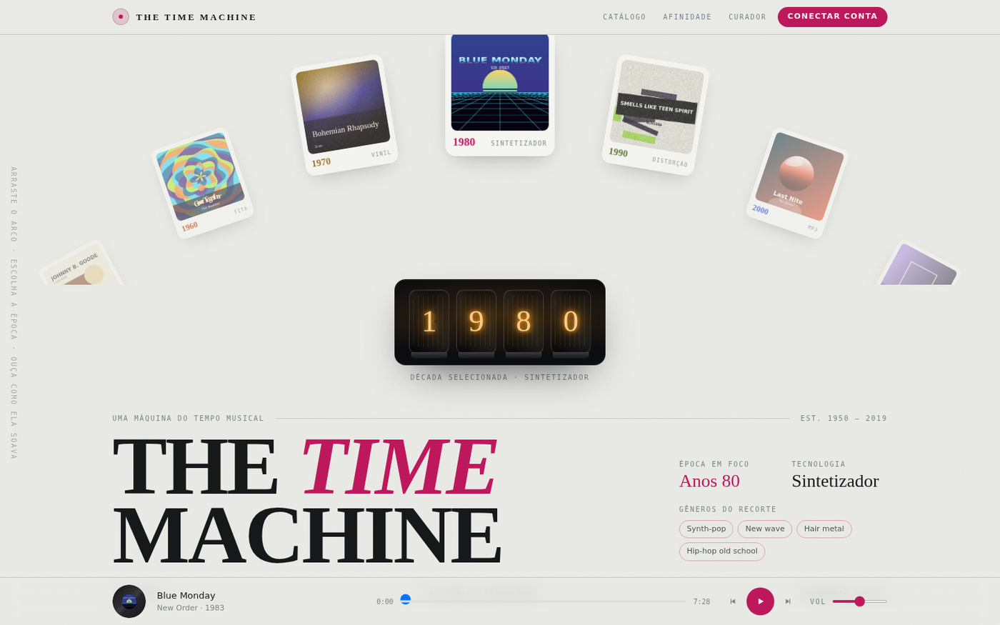
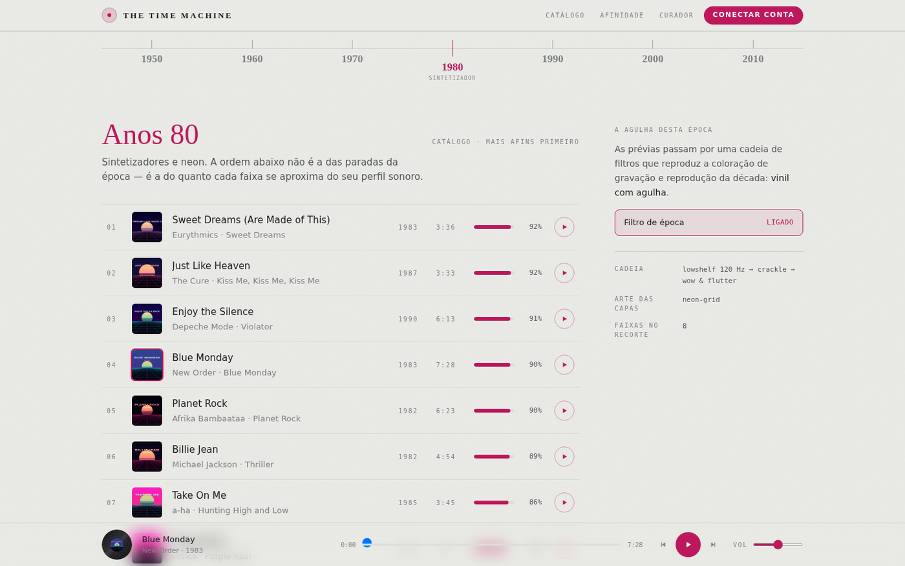
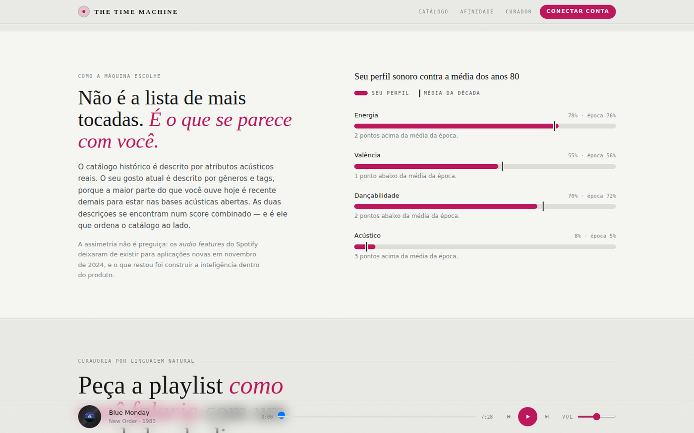

# The Time Machine

Site 2D de descoberta musical por década: carrossel em arco, relógio de tubos Nixie,
catálogo ordenado por afinidade com o seu perfil sonoro, filtros de áudio por época e
curador em linguagem natural.



```bash
npm install
npm run dev      # http://localhost:5173
npm run build    # tsc --noEmit + build de produção
npm run build:single   # tudo num único .html, sem servidor
```

Node 18+. Roda **inteiramente offline** — nenhum asset, nenhuma CDN (salvo as fontes),
nenhuma API. Bundle: 325 kB, 108 kB gzip.

---

## O que a página faz

| | |
| --- | --- |
| **Carrossel em arco** | 21 cartões numa circunferência de raio variável; arraste, inércia e encaixe em detente. O cartão no topo define a década. |
| **Relógio Nixie** | Quatro tubos em CSS com cátodo apagado ao fundo, malha de fios, flicker de gás e reacendimento escalonado de 40 ms na troca. |
| **Catálogo** | As faixas da época ordenadas por afinidade — não pelas paradas. |
| **Filtros de época** | Cadeia de insert do Web Audio por década, aplicada às prévias sintetizadas. |
| **Comparação de perfil** | Gráfico de bala: barra = você, marca de referência = média da década. |
| **Curador** | Prompt em linguagem natural, resposta em streaming, playlist montada com capa gerada. |

Atalhos: `espaço` toca/pausa · `←` `→` troca de década.

---

## Telas

| Catálogo | Comparação de perfil |
| --- | --- |
|  |  |

---

## Decisões de design

**Papel frio, não creme.** O fundo é um cinza levemente esverdeado de ficha de arquivo.
O creme quente com serifa e acento terracota é o clichê visual do momento; a página
foge dele de propósito, e o único objeto escuro é o painel do relógio — que é onde o
brilho âmbar dos tubos precisa de contraste para existir.

**Três famílias, três funções.** Bodoni Moda (títulos e o wordmark) é um tipo do século
XVIII revisitado no XX — apropriado para um produto que atravessa épocas. Archivo carrega
o texto corrido. Space Mono é o *chrome* do instrumento: anos, durações, índices, etiquetas.

**Uma tinta por década, legível sobre papel.** As cores neon que alimentam a arte das capas
(`accent`) não sobrevivem a um fundo claro. Cada década tem uma segunda cor, `ink`,
escolhida para passar em contraste AA como texto — é ela que colore o wordmark, os títulos
e os controles.

**O centro não é tudo.** O arco e o relógio ficam centrados porque são mecanismos; o
wordmark e o texto ficam alinhados à esquerda, com a ficha da época ocupando o vazio à
direita. Página inteiramente centralizada é o sotaque de layout gerado.

---

## Matemática do carrossel

Cada cartão vive numa circunferência cujo centro fica abaixo do rodapé da seção — só a
calota superior aparece, e o corte lateral é intencional.

```
translate(-50%,-50%) rotate(a) translateY(-R) rotate(-a·0.45)
                     └ põe na circunferência ┘ └ amansa a inclinação ┘
```

As sete décadas se repetem **três vezes** ao longo do círculo (21 cartões, passo de 17,1°).
Com sete só, o arco ficaria vazio entre os cartões; com a repetição a rotação é contínua e
a mesma década só reaparece 120° adiante, bem fora do campo visível.

A rotação é uma máquina de estados `idle → drag → fling → snap`. O arraste dita a
velocidade angular; ao soltar, o atrito é exponencial (`ω *= e^(−μ·dt)`) e, abaixo do
limiar, uma mola criticamente amortecida encaixa na detente. O raio se adapta ao viewport:
760 px num monitor deixa oito cartões visíveis, mas num celular deixaria dois e a queda
lateral ficaria quase vertical.

Toda suavização usa `damp(a, b, λ, dt) = b + (a − b)·e^(−λ·dt)`, independente de framerate —
`x += (alvo − x) * 0.1` chega em menos da metade do tempo a 144 Hz que a 60 Hz.

---

## Filtros de áudio por década

Cadeia de insert entre a fonte e o destino, reconstruída na troca de década com crossfade
de 320 ms:

| Década | Cadeia |
| --- | --- |
| 50s / 60s | bandpass 1.6 kHz Q0.9 → waveshaper tanh → chiado −34 dB → compressor 6:1 |
| 70s / 80s | lowshelf +2.5 dB @120 Hz → highshelf −3 dB @9 kHz → crackle de Poisson → wow & flutter |
| 90s | compressor 8:1 → lowpass 15.5 kHz → pré-eco 6 ms @ −22 dB |
| 00s / 10s | highshelf +1 dB @12 kHz |

A fonte é um sintetizador procedural: cada faixa gera um motivo determinístico a partir do
seu id e dos seus atributos acústicos. No produto real são prévias de 30 s do Deezer via
`MediaElementSource` — a única fonte que expõe PCM e, portanto, a única que o Web Audio
consegue filtrar (Spotify SDK é DRM, YouTube é iframe).

---

## O gráfico de comparação

A seção de afinidade **não** usa duas séries coloridas. O que importa ali é o desvio entre
o seu perfil e a média da época, então a barra carrega o seu valor e a média entra como
marca de referência sobre a mesma pista — dois papéis, duas formas de marca.

A escolha veio de rodar o validador de paleta: um cinza neutro como segunda série reprova
contra três das sete tintas de década (ΔE de visão normal abaixo de 15 — sépia, mostarda e
oliva ficam perto demais do cinza). Com formas diferentes, a identidade não depende de cor
e não há par categórico para separar sob daltonismo.

---

## Estrutura

```
src/
├─ components/
│  ├─ Hero.tsx            arco + Nixie + wordmark + ficha da época
│  ├─ ArcCarousel.tsx     a circunferência, a inércia e o encaixe
│  ├─ NixieClock.tsx      os quatro tubos, em CSS
│  ├─ DecadeDial.tsx      régua de sintonia (o controle acessível)
│  ├─ CatalogSection.tsx  catálogo ordenado por afinidade
│  ├─ AffinitySection.tsx gráfico de bala perfil × época
│  ├─ CuratorSection.tsx  prompt, streaming e playlist montada
│  ├─ PlayerBar.tsx       barra fixa com prato girando
│  ├─ TopBar.tsx · Footer.tsx
├─ lib/
│  ├─ math.ts             damp, mola crítica, easings, PRNG semeado
│  ├─ audioEngine.ts      sintetizador + cadeias de insert
│  ├─ covers.ts           sete geradores de capa + disco de vinil
│  └─ curator.ts          seleção de candidatos e streaming simulado
├─ hooks/useRaf.ts        loop de animação compartilhado
├─ store/useMachine.ts    estado único
└─ data/                  7 décadas · 56 faixas · trivia curada
```

---

## Acessibilidade

- O carrossel é `aria-hidden`: é uma afordância de ponteiro que duplica o dial de décadas.
  Vinte e um botões repetidos só poluiriam a árvore de acessibilidade — o controle real é
  o `<DecadeDial>`, navegável por teclado com as setas.
- Todas as tintas de década passam em contraste AA como texto sobre o papel.
- Foco visível na cor da década, `scroll-margin` nas âncoras, `prefers-reduced-motion`
  desliga animações e a rolagem suave.
- A identidade no gráfico nunca depende só de cor.

## Onde plugar o backend

| Arquivo | Hoje | Substituir por |
| --- | --- | --- |
| `lib/curator.ts` | seleção e streaming locais | SSE de `POST /v1/curate` |
| `lib/audioEngine.ts` | síntese procedural | `MediaElementSource` sobre o preview |
| `lib/covers.ts` | canvas | `gemini-3-pro-image` com o `cover_prompt` |
| `data/tracks.ts` | 56 faixas mockadas | `GET /v1/decades/{id}/tracks?taste=1` |
| `data/tracks.ts` → `DEMO_TASTE` | perfil fixo | `GET /v1/me/taste` |
| `TopBar` / `Footer` | conexão simulada | OAuth2 Spotify / YouTube Data API v3 |

## Limitações conhecidas

- O áudio é sintetizado, não são as gravações reais.
- Os metadados das faixas são um recorte curado à mão para demonstração.
- A roda do mouse só gira o arco com Shift ou gesto horizontal — sequestrar a rolagem
  vertical numa página que rola é hostil.
